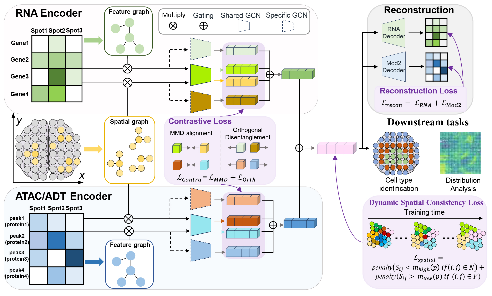

# smiMAD


## Data Download Link
The associated datasets can be accessed at https://zenodo.org/records/15954012

## System requirements
+ smiMAD need enough RAM and a NVIDIA GPU to support operations
+ Python dependencies, The important packages including:
```
    python                   3.8
    torch                    1.8.0
    scikit-learn             1.1.1
    matplotlib               3.4.2    
    huggingface-hub          0.2.1
    pandas                   1.4.2
    numpy                    1.22.3
    pandas                   1.4.2
    scanpy                   1.9.1
```

## How to use smiMAD
There are three ways to run in total.
+ the simulated dataset for running in the [Tutorials](./Tutorials/).
+ the command for running on real RNA & ADT datasets is as follows：
 ```
python run.py --file_fold /mnt/sdb/tyh/Data_SpatialGlue/MouseEmbryo/ --save_path /mnt/sdc/tyh/MouseEmbryo.h5ad --n_cluster 14 --radius 0.08 --datatype DBiT‑seq --spatial_neighbors 17 --omics1_neighbors 20 --omics2_neighbors 20 --epoch 1000
``` 
+ the command for running on real RNA & ATAC datasets is as follows：
 ```
python run_ATAC.py --file_fold /mnt/sdb/tyh/Data_SpatialGlue/MISAR_mouse_E15/ --save_path /mnt/sdc/tyh/MISAR_mouse_E15_tmp4.h5ad --n_cluster 7 --radius 0.05 --datatype MISAR-seq --spatial_neighbors 18 --omics1_neighbors 5 --omics2_neighbors 5 --epoch 3000
``` 
